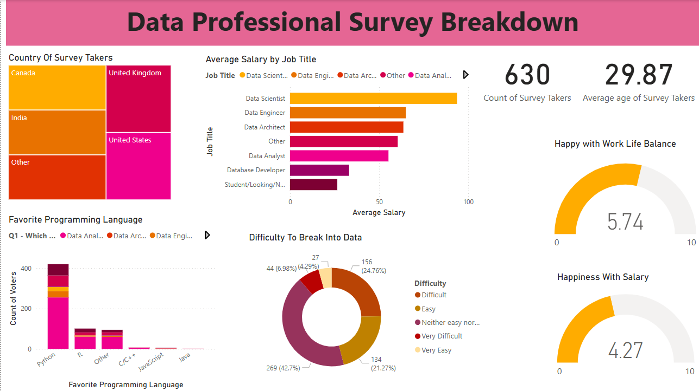

# Power BI Survey Dashboard

This project is an end-to-end data visualization solution built using Power BI to analyze survey responses from data professionals worldwide. The goal of this dashboard is to present meaningful insights about industry trends, job roles, salaries, tool usage, and overall job satisfaction among people working in data-related fields.

## Purpose

The objective was to transform raw survey data into an interactive, intuitive, and visually appealing dashboard that enables users to:

- Understand the global distribution of data professionals
- Analyze salary patterns across different job titles
- Explore preferred programming languages and tools
- Assess work-life balance and happiness with salary
- Understand the difficulty level people face while entering the data industry

## Dataset Cleaning & Preparation

The original dataset (Excel format) was first examined for missing values, irrelevant columns, and inconsistent entries. Data cleaning involved:

- Removing empty or incomplete rows
- Standardizing categorical values (e.g., job titles, countries)
- Renaming columns for clarity
- Ensuring numeric fields like salaries were correctly typed/formatted

After preprocessing, the cleaned dataset was loaded into Power BI.

## Features

- **Interactive Filters**: Selecting any country, job title, or language dynamically updates the entire dashboard using cross-filtering.
- **Visual Variety**: Used bar charts, pie/donut charts, treemaps, gauge visuals, and cards to display key insights.
- **Custom Themes & Formatting**: Applied a consistent color scheme and clean layout for better readability.
- **Page-level and Report-level Filters**: Implemented to allow specific views and global filtering options.
- **Responsive Design**: Optimized layout so visuals remain clean and legible across screen sizes.

The dashboard helps users quickly identify trends, compare insights across demographics, and gain a broad understanding of the data industry landscape.

---

## Files Included

- `Data_Professional_Survey.pbix` – Power BI dashboard file  
- `Power BI - Final Project.xlsx` – Raw dataset  
- `screenshots/Overview.png` – Full dashboard view

---

## Dashboard Preview

### Full Overview

Example: When you click on India in the "Country of Survey Takers", all graphs update to show metrics specific to Indian respondents.

---

## Insights Shown

- Average salary by job title
- Work-life balance vs salary satisfaction
- Programming language preferences
- Difficulty level in entering the data field
- Survey demographics by country

---

## Tools Used

- Power BI Desktop
- Microsoft Excel
